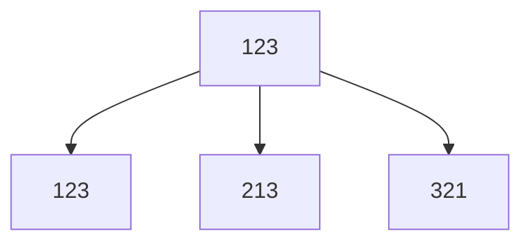
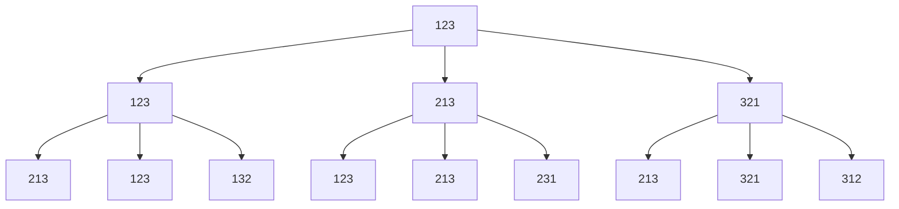
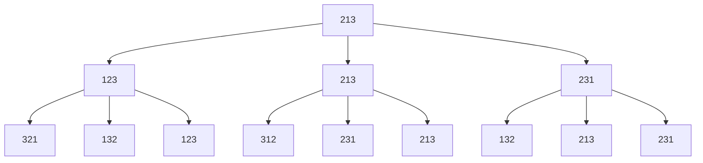
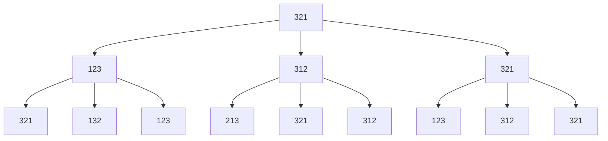

# Fisher–Yates shuffle

`2022/4/24`

關於洗牌這件事又得從研究所時期說起了，因為我當時是開發蜜月橋牌 AI，需要有洗牌發牌這件事，當時也是被彥吉大神上了一課，吉神就像是我的第二個指導教授一樣，感恩吉神讚嘆吉神。

## Shuffle an Array

說是洗牌其實也可以想成要<font v-pre color="#c2534c">打亂一個</font>`array`，洗牌只是其中一個應用場景，只說洗牌可能會讓人誤會，因為現實世界中洗牌的方式有很多種，比如我們很常見到的[交疊洗牌 Riffle Shuffle](https://en.wikipedia.org/wiki/Shuffling#Riffle)。

{:width='45%'}

上面這個就是交疊洗牌。<br>
剛好最近翻到 2016 的照片就順手貼上來 XDD，當時與魔術社的好友德偉一起在整理一些紙牌技巧，心血來潮就幫他拍了一些照片，當時真的是很瘦阿，髮型也很潮，<font v-pre color="#c2534c">歲月真的是一把殺豬刀</font>。

剛好在 leetcode 中也有一題[1470. Shuffle the Array](https://leetcode.com/problems/shuffle-the-array/)是類似這種交疊洗牌的，只是他要完美的一張一張分開交疊，這種完美的交疊洗牌叫做[Faro Shuffle](https://en.wikipedia.org/wiki/Faro_shuffle)，中文好像通常稱為完美洗牌或是鴿尾式洗牌，這種洗牌蠻酷的可以做到很多事情，比如我知道只要<font v-pre color="#c2534c">連做 Faro shuffle 8 次，整副牌的順序就會恢復原狀</font>，但好像根據 out、in(本來第一張牌在上還在下)的洗法也會有差異的樣子，好像混合洗最快<font v-pre color="#c2534c">6 次</font>就可以還原，我也是點了[wiki](https://en.wikipedia.org/wiki/Faro_shuffle#Perfect_shuffles)的資料進去看到介紹才知道的，應該很多人以前在學 Faro 的時候都只知道 8 次吧，難道是我已知用火?!

<font v-pre color="#c2534c">有學過的可以留言告訴我，你們一開始就知道是 6 次還是跟我一樣聽到 8 次。</font>

> 更正一下，這邊 6 次是要剛剛好 64 張牌才可以，52 張的話還是要 8 次才可以，是我沒看清楚 XD，感謝魔術圈的仲神與不認識的大神們提醒，在此修正。<br>
> 2022/7/18

那我這邊要探討的不是現實中的洗牌，而是 leetcode 的[384. Shuffle an Array](https://leetcode.com/problems/shuffle-an-array/)，對的沒錯，剛好 leetcode 都有，我比較意外的是這題居然被歸類為 medium 的題目。

簡單說就是<font v-pre color="#c2534c">要公平的打亂，造成每種組合的機率要相等</font>。<br>
比如丟骰子，丟兩顆骰子會出現 2~12 點共 11 種可能，但造成這些可能的機率並不一樣，比如點數 7 應該是比較容易出現的，能造成 7 點的組合有 2 跟 5、1 跟 6、3 跟 4，但是能造成 12 點的就只有兩個 6 了，機率明顯比較小，所以如果是要打亂骰子就不是一個公平的打亂。

## 實作

### 直覺的做法

多宣告一個 array，然後將原來 array 裡的值隨機一個一個 push 到新 array 中，這是我最直覺想到的做法，應該也是很多人的第一感。

```javascript
function shuffle(deck) {
  const newDeck = [];
  while (deck.length > 0) {
    const r = Math.floor(Math.random() * deck.length);
    const card = deck.splice(r, 1);
    newDeck.push(...card);
  }
  return newDeck;
}
```

其實這麼做也沒問題，就是效率差了點，因為 array 的 delete 為 $O(n)$ ，這樣子的時間複雜度就為 $O(n^2)$ ，那再來試試看能不能優化一下

### 直覺的優化做法

想法大致上就是從第一張牌開始，隨機的跟其他張牌交換，這樣一直換到最後一張牌，這些操作都在同個 array 中完成，所以就能將時間複雜度優化到 $O(n)$ 了！

```javascript
function shuffleX(deck) {
  for (let i = 0; i < deck.length; i++) {
    const r = Math.floor(Math.random() * deck.length);
    [deck[i], deck[r]] = [deck[r], deck[i]];
  }
}
```

```
[deck[i], deck[r]] = [deck[r], deck[i]]
```

這段就只是交換他們的值，算是 js 很方便的語法，其他語言寫起來應該是要像下面這樣，多宣告一個變數作為暫存。

```
temp = deck[i]
deck[i] = deck[r]
deck[r] = temp
```

然而這段看似簡單的想法其實是會有問題的，可以先自己想想看問題是什麼，再往下看分析。

### Fisher-Yates Shuffle

我就先直接放上本篇主題[Fisher-Yates Shuffle](https://en.wikipedia.org/wiki/Fisher%E2%80%93Yates_shuffle)，讓大家可以想一下這兩個做法的差別。<br>
其實想法也是很簡單，就是交換過的就不再換了，比如第一張牌可以跟 52 張牌換，換完後第一張牌就固定了，到第二張牌只能跟後面 51 張牌換，第三張牌只能跟 50 張換，依此類推，最後一張牌就不用換了，因為也只能跟自己換。<br>
實作上我是從後面換回來，這樣只要讓 random number 的範圍每次都-1 就好，當然你想要從前面開始也可以。

```javascript
function shuffle(deck) {
  for (let i = deck.length - 1; i > 0; i--) {
    const r = Math.floor(Math.random() * (i + 1));
    [deck[i], deck[r]] = [deck[r], deck[i]];
  }
}
```

## 分析

那上面兩種方法到底會有什麼影響呢？<br>
那就是造成的結果不公平，機率不平均的問題！<br>
實際給數字來實驗看看吧，數學超差的我最喜歡帶數字進去算了，當然還有最純粹的暴力解！<br>

給定一個初始值為 1,2,3 的 array`deck`

```javascript
const deck = [1, 2, 3];
```

正常打亂 123 的結果可能有 3 x 2 x 1 = 3! = <font v-pre color="#c2534c">6 種可能</font>，分別為 123、132、213、231、321、312。<br>
但是用我們上面的方法來做的話，可能的換法為 $3^3$ = <font v-pre color="#c2534c">27 種，但是實際上不一樣的組合只有 6 種，這樣就會造成某種組合比較容易出現，機率不平均的問題。</font>

### 暴力展開

舉個例子：<br>
給一個初始為 123 的 array，使用較差的做法出來後分佈如下圖

第一次換有三種換法

- index1 跟 index1 換 --> 123<br>
- index1 跟 index2 換 --> 213<br>
- index1 跟 index3 換 --> 321<br>

(為了方便理解我這邊 index 從 1 開始算)



第二次換

拿 123 的分支當範例

- index2 跟 index1 換 --> 213<br>
- index2 跟 index2 換 --> 123<br>
- index2 跟 index3 換 --> 132<br>

213 的分支

- index2 跟 index1 換 --> 123<br>
- index2 跟 index2 換 --> 213<br>
- index2 跟 index3 換 --> 231<br>

依此類推如下圖



第三次換<br>
（這邊因為整棵樹會太大，我把根節點拿掉且拆成三顆子樹來看）






全部列出來後可以看到<font v-pre color="#c2534c">能造成 123、321、312 的換法有 4 種，而能造成 132、213、231 的換法則有 5 種。</font><br>
通過不同的交換方式卻能產生相同的結果，但造成的各種結果機率並不一樣。

### 程式驗證

數字小的時候可能還會以為是機率問題而沒有感覺，那我們就直接讓他跑 60 萬次看看結果，如果機率是相同的那應該會每種可能都差不多出現 10 萬次。

```javascript
const count = { 123: 0, 132: 0, 213: 0, 231: 0, 312: 0, 321: 0 };

for (let i = 0; i < 600000; i++) {
  const deck = [1, 2, 3];
  shuffleX(deck);
  count[deck.join('')]++;
}

console.log(count);
```


再來看看使用 Fisher-Yates Shuffle 後的結果


4 張牌的時候差距就更明顯了，這邊洗了 240 萬次，一樣理論上每種可能都會出現差不多 10 萬次。


可以看到明顯機率不平均


## 心得

其實我自己是不會犯本文中的錯誤的，不是因為我多厲害，是我當時把功能做出來之後根本不會去優化，能動就好，優化是什麼？能吃嗎？<br>
不優化就不會犯錯 XDD，所以我感覺這個錯誤應該是夠厲害的人才會犯的錯，總之還是學習了。<br>
當時是因為我的發牌實在寫得很搞笑讓彥吉看不下去了，叫我去查查，才知道這個洗牌的，後來在做平台的時候也用上了，在記錄這篇的時候還查到了 faro shuffle 的冷知識，有種無用的知識增加了的感覺。

## Reference

[JavaScript 學演算法（二十一）- 洗牌演算法](https://chupai.github.io/posts/2008/shuffle_algorithm/)<br>
[The Danger of Naïveté](https://blog.codinghorror.com/the-danger-of-naivete/)

## 新登場人物

彥吉大神：<br>
我研究所時的學長，之前沒詳細介紹過吉神，簡單說就是神，不是學霸而是神，學霸年年有，但是神是久久才會出現一次的，碩士兩年不曉得寫了幾篇論文，都數不清他出國發表幾次了，而且各種得獎，當年也受到彥吉大神很多的幫忙是個非常照顧人的學長，甚至連出社會開始工作了我還是一直找吉神幫忙，感恩彥吉讚嘆彥吉！

德偉：<br>
大學時期魔術社的好夥伴，攝影師、3D 動畫師，是個非常有喜感的人，感覺他的人生就是在變胖與瘦回來之間無限循環，只要一年不見就會發現他完全變了個人，厲害的是他都還能瘦得回來。

[回到目錄](/coding/)
