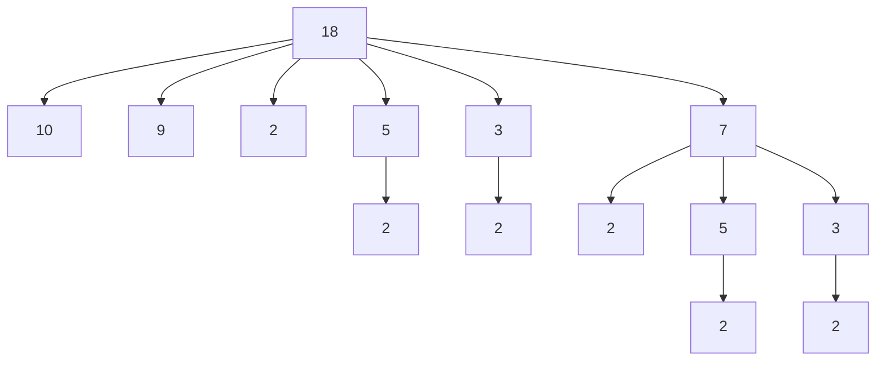

# 2022 面試白板題

> Jul 15, 2022

## 解題分享

因為新工作用 java 開發，所以我之後實作應該很多都會改用 java 寫當作練習，反正應該很少人真的有在看 code 的。

### Longest Increasing Subsequence

[300. Longest Increasing Subsequence](https://leetcode.com/problems/longest-increasing-subsequence/)

#### 題目描述

直翻成中文就是最長遞增子序列，大家會有疑問的應該是子序列吧，我覺得演算法筆記這邊的解釋蠻好的。

> 「子序列」。 sequence 之中，依照由左到右的順序，挑幾個數字出來，就是 subsequence 。其中 sub- 的意思是「附屬、次要」。<br>
> 例如 1 3 5 2 9 的其中一個子序列是 3 9 。<br>
> 例如 1 3 5 2 9 的其中一個子序列是 1 5 2 9 。<br>
> 空集合（不取）、原序列（全取），都是子序列！

而這題就是要你找出最長遞增子序列的長度。

leetcode 範例：

```
Input: nums = [10,9,2,5,3,7,101,18]
Output: 4
```

其中一組 LIS 是 2、5、7、101 長度是 4

這題對我來說挺特別的，正確來說不是這題，而是他的類似題，還記得大學時期我修了劉嘉傑老師開的演算法，老師有一次在課堂上分享他的論文，是 LCS([Longest Common Subsequence](https://en.wikipedia.org/wiki/Longest_common_subsequence_problem))的改進，在填表過程中可以少計算一部分資訊，讓速度更快，具體細節有興趣的可以去看看，論文傳送門在此：[在壓縮字串中解序列比對問題：最大共同子序列,編輯距離及重複序列 Solving Some Sequence Problems on Run-Length Encoded Strings : Longest Common Subsequences, Edit Distances, and Squares](https://hdl.handle.net/11296/3ab6dm)<br>
於是我就對 LCS 印象非常深刻，當時回家還花了 10 小時左右把程式給實作出來，對的，你沒聽錯，就是 10 小時，<font v-pre color="#c2534c">差不多就是吃完晚餐開始寫，然後天快亮了終於寫出來</font>，因為那時候我程式能力超爛，堅持不想上網查，努力寫出來，當時做出來真的是成就感滿滿，<font v-pre color="#c2534c">結果某次我與高中同學閒聊，他表示：這不就跟呼吸一樣自然嗎？</font>你是哪邊有問題？(我腦子有問題 QQ)<br>
我才發現我真的是超級爛，加上當時 AlphaGo 的橫空出世，讓我對 AI 與演算法充滿了好奇，於是就下定決心要考研究所。

故事說完了還是回來解題吧。

#### 想法

測資用 leetcode 給的`nums = [10, 9, 2, 5, 3, 7, 101, 18]`<br>
要怎麼找到 LIS 呢？我們只要窮舉所有的遞增序列，挑其中最長的即可。<br>
首先固定序列最後一項的數字，比如目前 array 的最後一項 18，先以 18 當序列結尾，往前找到 10、9、2、5、3、7 這些都可以接上 18，依此類推繼續找下去，這邊就是遞迴求解，把所有組合都試過之後，就能找到以 18 為序列結尾的 LIS。



這邊可以看到 2、5、7、18 跟 2、3、7、18 就是以 18 為結尾的 LIS，<font v-pre color="#c2534c">但是整個序列的 LIS 不一定是以 18 為結尾的</font>，說不定不要接 18 的話還可以接得更長(例如在 101 後面多加入 105、120)，所以必須要將每個數當結尾的 LIS 都找出來，找到最長的那個才是整個序列的 LIS。

但如果直接遞迴解的話，效率會非常差，我這裡就不寫了，看一下圖就懂了。


我們會發現很多地方都重複計算了，光是找以 18 為結尾的 LIS 就會重複計算以 5、3、2 為結尾的 LIS，之後找以 7 為結尾的 LIS 的時候一樣會在重複計算到，重複計算的部分非常多，這樣時間複雜度是 $O(2^n)$ 非常恐怖。

這邊使用[DynamicProgramming](https://en.wikipedia.org/wiki/Dynamic_programming)的觀念來解，用一個額外的陣列來紀錄以各數字為結尾的 LIS 長度，後面遇到就不用再重新計算了。

#### 實作

```java
public int lengthOfLIS(int[] nums) {
    int[] lis = new int[nums.length];
    int max = 0;
    for (int i = 0; i < nums.length; i++) {
        lis[i] = 1;// 長度至少是1
        for (int j = 0; j < i; j++) {
            if (nums[i] > nums[j] && lis[i] < lis[j] + 1) {
                lis[i] = lis[j] + 1;
            }
        }
        if (max < lis[i]) {
            max = lis[i];
        }
    }
    return max;
}
```

`lis` 是用來紀錄以此數字為結尾的 LIS 長度<br>
這樣時間複雜度就是 $O(n^2)$ 比起遞迴的快太多了，當然還有一些優化方式可以更快，我這邊就不展開了，可以到 reference 去看。

其實 DP 真的是我比較弱的部分，我覺得變化很多，比如這題還有個應用問題是 [354. Russian Doll Envelopes](https://leetcode.com/problems/russian-doll-envelopes/) 其實就是運用 LIS 來解，但這個真的對我來說超級難，得不斷地去練習這類型題目才有可能在面試的時候能想出來，也可能根本想不出來。

### Candy

[135. Candy](https://leetcode.com/problems/candy/)

#### 題目描述

有 n 個孩子排成一排，每個人都有一個`ratings`，我這邊就當作是每個孩子的分數，考完試了大家拿著考卷排排站好，老師要發糖果，條件是：

1. 每個孩子至少要有一顆糖果<br>
2. 分數(`ratings`)高的孩子要比他旁邊的孩子拿到更多糖果<br>

簡單說這題就是問至少要發多少糖果。

leetcode 範例：

```
input: ratings = [1, 0, 2]
output: 5
```

由左至右排第二個的孩子給他 1 顆糖，那排第一跟三的孩子最少得給 2 顆糖，所以至少要發 5 顆糖果。

#### 想法

我當時只有暴力解，沒有什麼想法，來還原一下過程吧，只是我一樣都改用 java 寫。<br>
我一開始想著，這還不簡單，先全部發一顆糖果，然後一個 for 迴圈掃過去，只要分數比旁邊同學高的就多給他一顆，果然我還是太淺了，還好隨便帶個測資進去就發現錯得離譜。<br>
例如： `[5, 4, 3, 2, 1]` 的這種，用上面的方法就會變成 2、2、2、2、1。<br>
所以要修正一下，只要有人多發了糖果，就要回頭檢查他前面的人，如果要修改，那就得再往前繼續檢查，所以就得再加一個 for 迴圈一路檢查回去。

#### 實作

```java
public int candy(int[] ratings) {
    int[] candy = new int[ratings.length];
    if (ratings.length == 1) return 1;// 只有一個人
    Arrays.fill(candy, 1);// 所有人都先給一顆
    for (int i = 0; i < ratings.length; i++) {
        // 最後一項往前檢查
        if (i == ratings.length - 1) {
            if (ratings[i] > ratings[i - 1] && candy[i] <= candy[i - 1]) {
                candy[i] = candy[i - 1] + 1;
            }
            break;
        }
        // 第一項只往後檢查
        if (i == 0) {
            if (ratings[i] > ratings[i + 1] && candy[i] <= candy[i + 1]) {
                candy[i] = candy[i + 1] + 1;
            }
        } else {
            if (ratings[i] > ratings[i - 1] && candy[i] <= candy[i - 1]) {
                candy[i] = candy[i - 1] + 1;
            }
            if (ratings[i] > ratings[i + 1] && candy[i] <= candy[i + 1]) {
                candy[i] = candy[i + 1] + 1;
                // 回頭檢查前面
                for (int j = i; j >= 1; j--) {
                    if (ratings[j] < ratings[j - 1] && candy[j] >= candy[j - 1]) {
                        candy[j - 1] = candy[j] + 1;
                    }
                }
            }
        }
    }
    int sum = 0;
    for (int i : candy) {
        sum += i;
    }
    return sum;
}
```

leetcode 有一個測資是只有一項<br>
所以要加上 `if (ratings.length == 1) return 1` 才行，當天我是真的在白板上寫的，我根本沒有特地處理最後一項跟第一項，回家寫出來才發現其實這樣過不了，我的 array 會超過範圍，一開始跑個`candy[i-1]`就會爆了 XDD

是說我連暴力解都寫得蠻爛的，我後來看到別人的暴力解，簡潔不少。<br>
這樣做時間複雜度是 $O(n^2)$ 結果 leetcode 也會過，有點意外，我以為一定要有什麼優化才行。

#### 優化

我當天嘗試了一些方法優化感覺都沒什麼用，最後面試官有跟我說 leetcode 上的方法，就跟我一開始的想法一樣，<font v-pre color="#c2534c">直接從左掃到右，這邊不一樣的是他還多做了從右掃到左，最後從兩個中取最大的</font>，居然就是答案，真是太神奇了，下圖是 leetcode 的圖。<br>


從第二個開始只跟左邊比，如果比左邊的分數高就要比他多一顆。<br>
從倒數第二個開始只跟右邊比，如果比右邊的分數高就要比他多一顆。<br>
這樣還不用處理邊界，寫起來整個簡潔又好懂！<br>
我自己是覺得蠻神奇的，至少我根本不會想到，真的是學到很多～

```java
public int candy(int[] ratings) {
    int[] left2right = new int[ratings.length];
    int[] right2left = new int[ratings.length];
    Arrays.fill(left2right, 1);
    Arrays.fill(right2left, 1);
    // 從左到右
    for (int i = 1; i < ratings.length; i++) {
        if (ratings[i] > ratings[i - 1]) {
            left2right[i] = left2right[i - 1] + 1;
        }
    }
    // 從右到左
    for (int i = ratings.length - 2; i >= 0; i--) {
        if (ratings[i] > ratings[i + 1]) {
            right2left[i] = right2left[i + 1] + 1;
        }
    }
    // 取最大
    int sum = 0;
    for (int i = 0; i < ratings.length; i++) {
        sum += Math.max(left2right[i], right2left[i]);
    }
    return sum;
}
```

這樣時間複雜度就優化到了 $O(n)$ ，leetcode 上還有其他解法，有興趣的可以自己再去看看。

> 寫著寫著發現又寫太多廢話了，未來有機會再開一篇新的來補下面三題吧。<br>
> Jul 22, 2022

### Median of Two Sorted Arrays

[4. Median of Two Sorted Arrays](https://leetcode.com/problems/median-of-two-sorted-arrays/)

### Merge Intervals

[56. Merge Intervals](https://leetcode.com/problems/merge-intervals/)<br>
[986. Interval List Intersections](https://leetcode.com/problems/interval-list-intersections/)

> 已補上[Merge Intervals](/coding/mergeIntervals.md)<br>
> Jul 30, 2022

### C++相關問題

#### const 位置的差別

`const int *p` 、 `int * const p` 、 `const int * const p`、`int const *p`

:::info 吉神教學
新增彥吉大神教學：
前面的 const 是你指向的東西的型態是 const，後面的 const 是指這個指標是 const。
:::

`const int *p;`<br>
你指向的那個東西的值你不能改

```cpp
int n = 10;
const int *p = &n;
*p += 100; //這邊會出錯
```

`int * const p;`<br>
指標本身所記錄的位址不能被修改，也就是不能事後修改指到別的東西上

```cpp
int n = 10;
int m = 20;
int * const p = &n;
*p += 100; //可以修改n的值
p = &m; //但改指向m則會出錯
```

`const int * const p;`<br>
指標本身不能改，指向的目標也不能改

```cpp
int n = 10;
int m = 20;
const int * const p = &n;
*p += 100; // error
p = &m; // 也是 error
```

最後 `const int *p` 跟 `int const *p` 是一樣的<br>
感恩彥吉讚嘆彥吉！<br>

### 彩蛋

#### 計算 n 階乘

解題內容真的很無聊，能看到這邊的話那真是太厲害了，最後分享個特別搞笑的例子當作彩蛋吧，就是要計算 n 階乘，就這麼簡單的題目。

> 面試官：看到這題你會怎麼做？<br>
> 我：遞迴吧。<br>
> 面試官：那你直接寫在 word 上就好。<br>
> 我：

```javascript
function fn(n) {
  return n * fn(n - 1);
}
```

> 我：好了！<br>
> 面試官：就這樣嗎？有沒有覺得有什麼問題？<br>
> 我：痾...就這樣吧？看起來沒有問題！<br>
> 面試官：沒有覺得少了點什麼嗎？<br>
> 我：嗯...沒有吧。<br>
> 面試官：嗯...遞迴是要有終止條件的。

<font v-pre color="#c2534c">我真的快被自己笑死，怎麼能夠這麼低能，對方也把我當白痴，大概是會被當作午餐笑話跟同事說怎麼有個碩士畢業的連階乘都不會寫。</font>

這間是我沒有想去的公司，我是想著當作面試練習，就答應了面試邀約，約早上 9 點面試，我忘記那天要面試睡到 8:50 才起來，於是慌慌張張就打開筆電準備開始面試，當時腦袋大概還是昏迷狀態，欸不過這也不是藉口啦，但還是提醒各位面試時請保持精神狀況良好，不要像我一樣低能。

```java
public int Factorial(int n) {
    if (n == 1) {
        return 1;
    }
    return n * Factorial(n - 1);
}
```

```java
public int FactorialForLoop(int n) {
    int result = 1;
    for (int i = 1; i <= n; i++) {
        result *= i;
    }
    return result;
}
```

雖然應該沒有人不會，但還是把正解放上來，資訊相關科系大一新生就會的東西，我還寫錯ㄏㄏ。

## reference

[演算法筆記 LIS](https://web.ntnu.edu.tw/~algo/Subsequence.html#2)<br>
[Longest Increasing Subsequence](https://afteracademy.com/blog/longest-increasing-subsequence)

## 心得

我越寫越感覺演算法筆記的作者真的超強，要把這些寫得簡單易懂真的好難，極少數真的有把解題過程看完的人，如果我有寫錯或是覺得我哪裡寫太爛根本看不懂的，歡迎告訴我給我點建議，小羊可以請你喝個飲料當謝禮 XDD<br>
<font v-pre color="#c2534c">連階乘都不會寫的人都能找到工作</font>，應該能激勵到很多人，希望能讓很多沒自信的人也可以多去面試看看，說不定就能找到更適合更理想的工作，我身邊有一些朋友尤其是像我弟這樣的轉職仔，他們的共同點就是很沒自信，不太敢去面試，覺得自己能力不足，也不太敢去談薪水，其實不用想太多，<font v-pre color="#c2534c">面試也是一種檢驗自己的方式，就算過了也不一定要換工作啊</font>，我自己是打算每年都去面試，看看自己是否有所提升，如果又有什麼有趣搞笑的或是我又被瘋狂洗臉的，我一定會再寫一篇給大家笑一下的～<br>
最後希望每年的自己都能變得更強！共勉之～

## 新登場人物

劉嘉傑老師：<br>
大學時期對我很好的一個老師，因為第一堂課老師提到 AlphaGo 的事情，身為棋迷的我下課就忍不住去找老師討論，老師知道我會下棋後居然直接問我要不要跟他以前博士班的指導教授王老師下棋。

王有禮老師：<br>
劉嘉傑老師的老師，是台科資管系的教授，當時好像在北商當副校長，這邊我也不清楚，但王老師當時好像還有在教課的樣子。<br>

> 劉老師：有機會你可以跟我的老師下盤棋啊！<br>
> 我心想：跟老師的老師下棋壓力也太大了吧，還是先不要了。<br>
> 劉老師：不過我覺得你應該下不過，我的老師是很厲害的六段。<br>
> 我心想：居然說我下不過！下！我一定要下！(整個中二到爆，但我當時真的這麼想 XDD)<br>
> 我：好的老師，12 月後的時間我都沒問題(那時候我都在準備魔術社的表演就拖了好久)。

後來居然就真的約成了，跑去台科大跟王有禮老師下了盤棋

{:width='75%'}

找到 2016 時的照片，當時我頭髮還好多啊...<br>
這張照片是劉老師拍的，劉老師不會下棋還在旁邊等了我們這麼久，真的是很不好意思。<br>

下完棋後王老師知道了我要考資工所，直接就說要免費幫我上課，要我每週六下午到他台科的辦公室找他，還送了我不少書，我真的是受寵若驚，居然得到王老師一對一的指導。<br>
王老師與我是第一次見面，居然就對我這麼好，上劉老師的課也是第一堂，劉老師就說要帶我去跟王老師下棋，兩位老師都是第一次跟我見面，連我是怎麼樣的人都不知道，就願意對我這麼好，我真的非常感動。<br>
:::warning <div></div>
想來我的人生真的都離不開圍棋，多年來不斷在下棋與讀書間掙扎著，沒想到後來居然能結合到了一起，而且也是因為圍棋讓我能遇到了這麼多貴人，兩位老師的教誨我一生都不會忘記，謝謝老師。
:::
